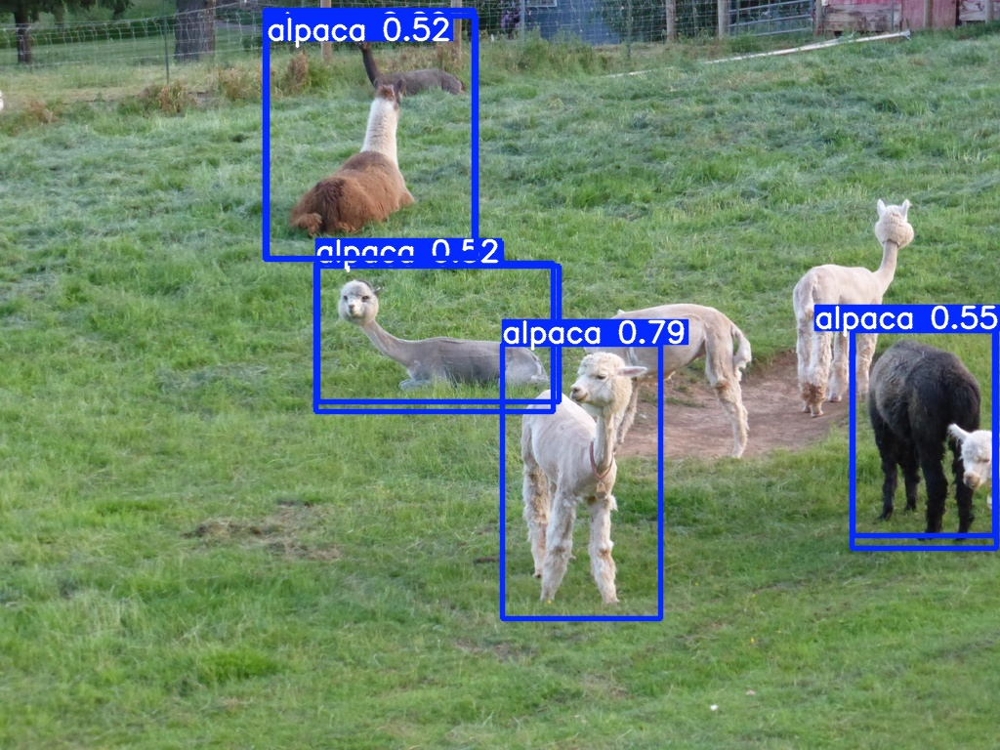

# 🦙 Alpaca Detection with YOLO Models

A computer vision project comparing YOLOv8n, YOLOv9t, YOLOv10n, and YOLOv11n models for alpaca detection.

## 📊 Dataset
- **Training Images**: 300 manually annotated images
- **Validation Images**: 52 images
- **Classes**: 1 (Alpaca)

## 🏆 Model Comparison Results

| Model        | mAP@0.5 | Precision | Recall | mAP@0.5:0.95 |
|--------------|---------|-----------|--------|--------------|
| YOLOv9t      | 0.669   | 0.707     | 0.638  | 0.454        |
| YOLOv10n     | 0.607   | 0.683     | 0.545  | 0.394        |
| YOLOv11n     | 0.678   | 0.743     | 0.615  | 0.477        |
| **YOLOv8n**  | **0.733** | **0.792** | **0.672** | **0.476** |

**Winner**: YOLOv8n with 73.3% mAP@0.5

## 🖼️ Results

### Image Detection

### Video Detection
- [alpaca.mp4_out](https://github.com/ganessa037/object-detection-alpaca/raw/main/alpaca.mp4_out)
- [alpaca2.mp4_out](https://github.com/ganessa037/object-detection-alpaca/raw/main/alpaca2.mp4_out)

